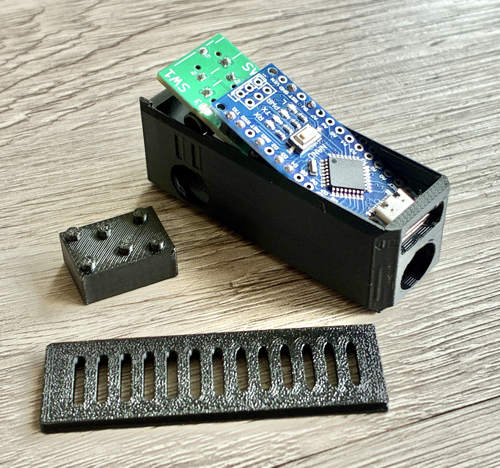
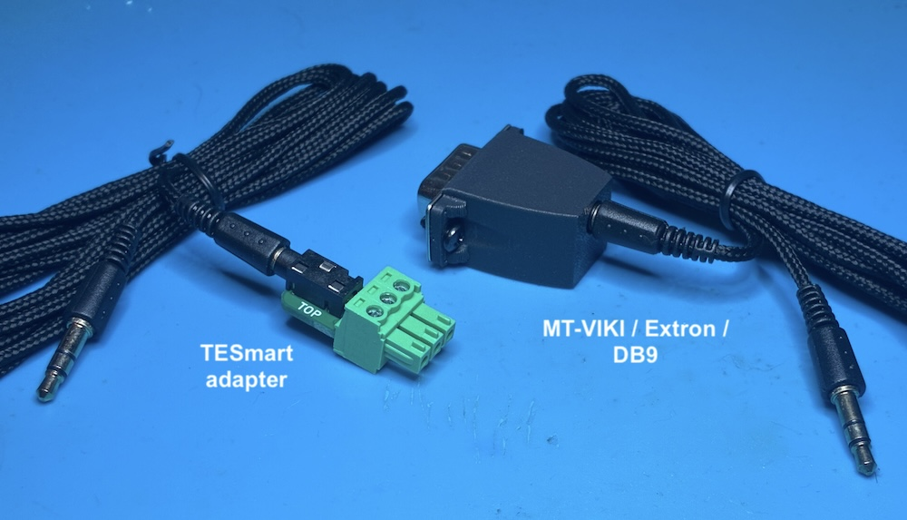
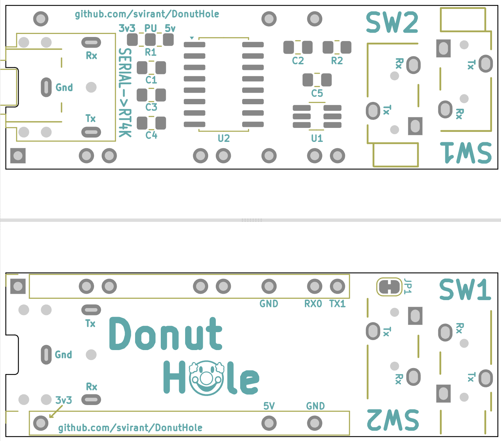
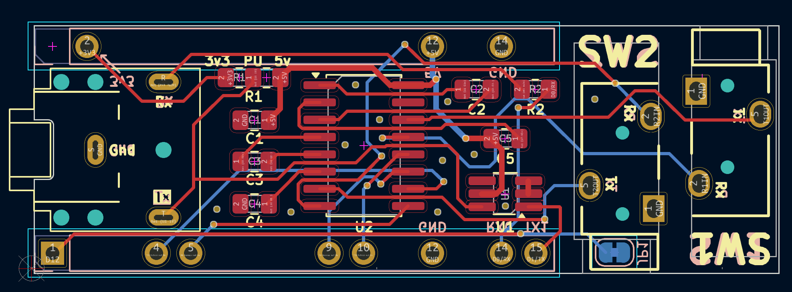
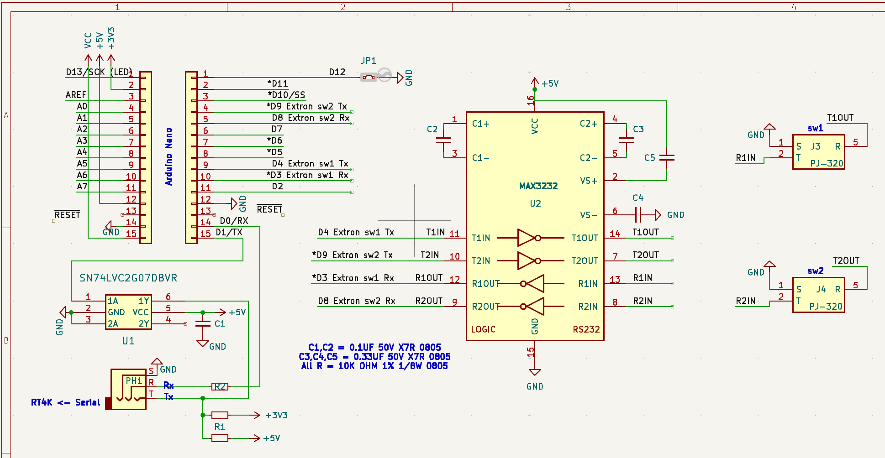

# Donut Hole

**mini version of the [Donut Dongle](https://github.com/svirant/DonutDongle) that enables auto profiles for RS-232 based switches for the RetroTink 4K Pro/CE**
 - 3DP case now available on [MakerWorld](https://makerworld.com/en/models/1433467-donut-hole-for-retrotink-4k?from=search#profileId-1490991)
 - Compatible with the SVS
 - Connect multiple Donut Holes, Donut Dongles, gSerial Enablers simultaneously via a headphone jack splitter.
   - Must reflash "firmware" with offset variable set so SVS profile numbers don't overlap.
   - Up to 5 have been connected together simultaneously. More may be supported, but this is the max number I've been able to test.
 - Full instructions listed below for building your own!

> [!TIP]
> If DIY is not your thing. I have assembled versions available in my [Ko-fi](https://ko-fi.com/donutswdad/shop) shop.
</br>

> [!NOTE]
> *NEW* beta allows:
> <br /> 
>   - **MT-VIKI Disconnection Detection** - when an input is powered off and on, the profile is resent.
>   - **front case buttons/remote NOW change profiles on the MT-VIKI HDMI switch.** Thanks to [Arthrimus](https://scalablevideoswitch.com/)! 
>   - **auto-switching on Extron Matrix switchers** that support DSVP. Works with RGBS/HV and HDMI/DVI signal types.
>   - **Support for older Extron Crosspoint (non plus) matrix switchers**
>
> 
> <br /> For Matrix auto-switching, use the follow Options to enable:
> ```
> bool automatrixSW1 = true; // set true for auto matrix switching on "SW1" port
> bool automatrixSW2 = false; // set true for auto matrix switching on "SW2" port
> 
> int amSizeSW1 = 8; // number of input ports for auto matrix switching on SW1. Ex: 8,12,16,32
> int amSizeSW2 = 8; // number of input ports for auto matrix switching on SW2. ...
>
> uint8_t const vinMatrix[65] = {0,  // MATRIX switchers  // When auto matrix mode is enabled: (automatrixSW1 / SW2 above)
>                                                       // set to 1 for the auto switched input to trigger a Preset on SW1
>                                                       // set to 2 for the auto switched input to trigger a Preset on SW2
>                                                       // set to 3 for both SW1 & SW2
>                                                       // set to 0 to disable this feature (default - aka input goes to all outputs unless defined in voutMatrix)
>                                                       //
>                                                       // set the following inputs to the desired Preset #
>                                                       // (by default each input # is set to the same corresponding Preset #)
>                                                       
> uint8_t const voutMatrix[66] = {1,  // MATRIX switchers // When auto matrix mode is enabled: (automatrixSW1 / SW2 above)
>                                                       // set to 1 for the auto switched input to go to ALL outputs (default)
>                                                       // set to 0 to select outputs to be enabled/disabled as listed below
>                                                       //
>                                                       // When auto matrix mode is disabled: 
>                                                       // ALL input changes to any/all outputs result in a profile change
>                                                       // disable specific outputs from triggering profile changes
> ```
<br />
<br />



<br />

# Supported Switches
(current list, but not limited to)
| **Switch**    | Supported | Notes |
| ------------- | ------------- |------------- |
| TESmart 16x1 HDMI  | yes, confirmed first hand  | [Amazon](https://a.co/d/9XwZDlt) link for reference|
| TESmart 8x1 HDMI  | unconfirmed, but should work, let me know! | |
| MT-VIKI 8 port HDMI | yes, confirmed first hand | [Amazon](https://a.co/d/eHo5uKs) link for reference|
| Extron RGBHV sw6  | yes, confirmed first hand  | auto-profiles triggered by manual selection or auto-switching |
| Extron SW4 VGA Ars | yes, confirmed by "Nobody" on the RT4K Discord | auto-profiles triggered by manual selection or auto-switching |
| Extron DXP 88 | yes, confirmed first hand | Auto-switching can be enabled in "Options" section of .ino.  Works with Presets. On SW1, Preset 1 is S1_ profile. On SW2, Preset 1 is S101_ profile, etc|
| Extron CrossPoint Plus, MVX, etc | yes, confirmed by other users | Auto-switching can be enabled for switches that supports DSVP and are RGBS/HDMI/DVI signal types. By default, works with Presets as shown in the Note above. |
| Extron CrossPoint (non Plus)  | yes, works with Presets and Input changes | Must set ExtronVideoOutputPortSW1 / SW2 variable to output connected to RT4K |

<br />

# Ordering PCBs
PCBs for this project:
 - [Donut Hole](https://github.com/svirant/DonutHole/blob/main/Donut_Hole.zip)
 - [VGA Adapter](https://github.com/svirant/DonutDongle/tree/main/Adapters) (VGAPassthrough or YC2VGA)
- (Optional) [TESmart_connector](https://github.com/svirant/DonutDongle/tree/main/Accessories)
- (Optional) [MT-VIKI / Extron / DB9 adapter](https://github.com/svirant/DonutDongle/tree/main/Accessories)
 
There are plenty of options for PCB manufacturing but I prefer [JLCPCB](https://jlcpcb.com) (No affiliation). Using the gerber (.zip) files provided, it's easy to place an order. Below are some tips/guidelines:
- 1.6mm Thickness
- For Surface Finish, "HASL(with lead)" is fine
- 4 Layer PCBs are the same cost as 2 Layer for the VGA Adapters. Because of that, the inner 2 layers are being used as ground planes for better EMI protection. Thanks to https://x.com/zaxour for the idea!
- "Remove Mark" option is now free on JLCPCB. Use it!
- All remaining default options should be fine
- Let me know if you have any questions!

# Assembly

[Interactive HTML BOM](https://svirant.github.io/DonutHole/images/ibom.html)

[](https://svirant.github.io/DonutHole/images/ibom.html)

# PCB


# Schematic



## Bill of Materials (BOM)

| **Qty**    | Designation | Part |  Link  |  Notes |
| ------------- | ------------- |------------- |------------- |------------- |
| 2  | C1,C2 | 0.1 uf / 100nf 50V X7R 0805 Capacitor| [Digikey](https://www.digikey.com/en/products/detail/yageo/CC0805KRX7R9BB104/302874?s=N4IgTCBcDaIMwEYEFokBYAMrkDkAiIAugL5A) | |
| 3  | C3 - C5 | 0.3 uf / 330nf 50V X7R 0805 Capacitor| [Digikey](https://www.digikey.com/en/products/detail/samsung-electro-mechanics/CL21B334KBFNNNE/3886781) | |
| 2  | R1, R2 | 10K OHM 1% 1/8W 0805 Resistor | [Digikey](https://www.digikey.com/en/products/detail/yageo/AC0805FR-0710KL/2827834) | |
| 1  | U1 | IC BUF NON-INVERT 5.5V SOT23-6 | [Digikey](https://www.digikey.com/en/products/detail/texas-instruments/SN74LVC2G07DBVR/486427) or [alternate](https://www.digikey.com/en/products/detail/umw/SN74LVC2G07DBVR/24889644) | |
| 1  | U2 | MAX3232 SOP-16 RS-232 Interface IC | [AliExpress](https://www.aliexpress.us/item/3256807314260762.html) | |
| 1  | PH1 | PJ-307 3.5mm Stereo Jack | [AliExpress](https://www.aliexpress.us/item/3256805624175150.html) | |
|    | |  or **1x** 3.5mm Audio Jack Socket | [AliExpress](https://www.aliexpress.us/item/2251832685563184.html) | Like the PJ-307 but missing the inner 2 poles which arent needed anyways |
| 2  | J2 | PJ-320 3.5MM Headphone Jack Audio Video Female | [AliExpress](https://www.aliexpress.us/item/3256807448104402.html) | Color: PJ-320B DIP | 
| 11  | J3,J4 | 2.54mm male pin headers | break off the male headers that come with the Arduino Nano | | 
| 1  | | Arduino Nano type c | Support [RetroRGB!](https://amzn.to/4gnHqN4) | Make sure the headers are not soldered. |
| 1  | | Any 3.5mm / aux / stereo / trs / cable | [AliExpress](https://www.aliexpress.us/item/2255799962255486.html) | |
| 1  | | usb-c cable for Arduino power & programming | [AliExpress](https://www.aliexpress.us/item/3256806983355947.html) | |
| (needed for RS-232 DB9 connections) | | MT-VIKI / Extron / DB9 adapter | [DIY](https://github.com/svirant/DonutDongle/tree/main/Accessories) | ...or purchase from below |
| | | DB9 Male to 3.5mm Male Serial RS232 Cable 6feet | [Amazon](https://www.amazon.com/LIANSHU-DC3-5mm-Serial-RS232-Cable/dp/B07G2ZL3SL/) | "MUST" be wired as so: [DB9 Male Pin 5 -> Sleeve, DB9 Male Pin 2 -> Tip, DB9 Male Pin 3 -> Ring](/images/7.png) |


# Programming an Arduino Nano
I recommend the [Official Arduino IDE and guide](https://www.arduino.cc/en/Guide) if you're unfamiliar with Arduinos. All .ino files used for programming are listed above. The following Library will also need to be added in order to Compile successfully.<br />
- **Libraries:**
  - <AltSoftSerial.h>  Follow these steps to add AltSoftSerial.h
    - Goto https://github.com/PaulStoffregen/AltSoftSerial
    - Click the GREEN "<> Code" box and "Download ZIP"
    - In Arudino IDE; goto "Sketch" -> "Include Library" -> "Add .ZIP Library"

Some Arduino Nanos come with an Old Bootloader and won't Upload unless specified. **If you get errors** when trying to upload, swap to this option as a possible fix.


## Steps to update offset
 - 1 - Download and install the [Arduino IDE](https://www.arduino.cc/en/software/) for your PC or Mac
 - 2 - Click the green "<> Code" button above and "Download ZIP".
 - 3 - Extract the .zip file and open up the "Donut_Hole.ino" file in the Arduino IDE. It will ask if you would like to move this file inside a folder, select OK.
 - 4 - With the source code now open, select "Tools" -> "Board" -> "Arduino AVR Boards" -> "Arduino Nano"
 - 5 - Connect the Donut Hole device to your PC or Mac using the usb-c cable. You should see an LED light up when connected.
 - 6 - With the Donut Hole now connected, select it's "port" by going to "Tools" -> "Port", and select the port that starts with "/dev/cu.usbserial-" (on Mac) or "COM" if on PC.
 - 7 - Almost done! :) In the code itself, find the line that starts with "uint16_t const offset = 0;" and change the 0 to 300. It should now look like this: uint16_t const offset = 300;
   - This will give you profiles 301 - 399 for SW1 and 401 - 499 for SW2
   - At the moment this is line 32
 - 8 - From the menu at the top, select "Sketch" -> "Upload". You should see the LEDs on the Donut Hole flicker and a message that says "Done uploading." if successful.
   - If you get errors, see the section above about changing the "Bootloader" type.
 - 9 - Disconnect the usb-c cable from your computer and give it a whirl! You can repeat these steps in the future to make any other changes or update if a newer firmware is ever released.

  -----------
# How to Use
- Make sure **"Auto Load SVS"** is **"On"** under the RT4K Profiles menu.  
- The RT4K checks the **/profile/SVS** subfolder for profiles and need to be named: **S\<input number>_\<user defined>.rt4**  For example, SVS input 1 would look for a profile that is named S1_SNES.rt4.  If there’s more than one profile that fits the pattern, the first match is used.

- Check the RT4K Diagnostic Console for Serial commands being received as confirmation.


## SVS Profile numbering scheme

**Input 1-10... = S1_ - S10_ ...,etc**

The "offset" option can be used if using multiple Donut Holes, gSerial Enablers, Donut Dongles are connected to the RT4K via a headphone splitter. For example, if using a 2nd, change "offset = 300" for the 2nd device to be SVS profiles 301 - 310.

```
uint16_t const offset = 0; // Only needed for multiple Donut Holes, gSerial Enablers, Donut Dongles. Set offset so 2nd, 3rd, etc gSEs don't overlap profiles. (e.g. offset = 300;) 
```
