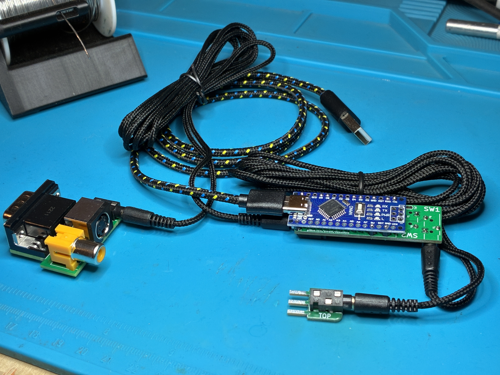

# Donut Hole

**mini version of the [Donut Dongle](https://github.com/svirant/DonutDongle) that enables auto profiles for RS-232 based switches for the RetroTink 4K Pro/CE**


<br />
<br />

# Supported Switches
(current list, but not limited to)
| **Switch**    | Supported | Notes |
| ------------- | ------------- |------------- |
| TESmart 16x1 HDMI  | yes, confirmed first hand  | |
| MT-VIKI 8 port HDMI | yes, confirmed first hand | Manual selection of inputs via front case buttons and included IR remote do not generate serial output on the switch itself therefor profile changes can't happen for these 2 methods. Auto selection works fine. |
| Extron RGBHV sw6  | yes, confirmed first hand  | |
| Extron DXP 88 | yes, confirmed first hand | Preset 1 is Profile/SVS 1. On Extron sw2 port Preset 1 is SVS 101, etc|
| Extron CrossPoint, MVX, etc | if it supports SIS, should work fine, please let me know :) |

<br />

# Ordering PCBs
PCBs for this project:
 - [Donut Hole](https://github.com/svirant/DonutHole/blob/main/Donut_Hole.zip)
 - [VGA Adapter](https://github.com/svirant/DonutDongle/tree/main/Adapters) (VGAPassthrough or YC2VGA)
- (Optional) [TESmart_connector](https://github.com/svirant/DonutDongle/tree/main/Accessories)
 
There are plenty of options for PCB manufacturing but I prefer [JLCPCB](https://jlcpcb.com) (No affiliation). Using the gerber (.zip) files provided, it's easy to place an order. Below are some tips/guidelines:
- 1.6mm Thickness
- For Surface Finish, "HASL(with lead)" is fine
- 4 Layer PCBs are the same cost as 2 Layer for the VGA Adapters. Because of that, the inner 2 layers are being used as ground planes for better EMI protection. Thanks to https://x.com/zaxour for the idea!
- "Remove Mark" option is now free on JLCPCB. Use it!
- All remaining default options should be fine
- Let me know if you have any questions!

# Assembly

[Interactive HTML BOM](https://svirant.github.io/DonutHole/images/ibom.html)

[](https://svirant.github.io/DonutHole/images/ibom.html)

# PCB


# Schematic


## Bill of Materials (BOM)

| **Qty**    | Designation | Part |  Link  |  Notes |
| ------------- | ------------- |------------- |------------- |------------- |
| 5  | C1 - C5 | 0.1 uf / 100nf 50V X7R 0805 Capacitor| [Digikey](https://www.digikey.com/en/products/detail/yageo/CC0805KRX7R9BB104/302874?s=N4IgTCBcDaIMwEYEFokBYAMrkDkAiIAugL5A) | |
| 2  | R1, R2 | 10K OHM 1% 1/8W 0805 Resistor | [Digikey](https://www.digikey.com/en/products/detail/yageo/AC0805FR-0710KL/2827834) | |
| 1  | U1 | IC BUF NON-INVERT 5.5V SOT23-6 | [Digikey](https://www.digikey.com/en/products/detail/texas-instruments/SN74LVC2G07DBVR/486427) or [alternate](https://www.digikey.com/en/products/detail/umw/SN74LVC2G07DBVR/24889644) | |
| 1  | U2 | MAX3232 SOP-16 RS-232 Interface IC | [AliExpress](https://www.aliexpress.us/item/3256807314260762.html) | |
| 1  | PH1 | PJ-307 3.5mm Stereo Jack | [AliExpress](https://www.aliexpress.us/item/3256805624175150.html) | |
|    | |  or **1x** 3.5mm Audio Jack Socket | [AliExpress](https://www.aliexpress.us/item/2251832685563184.html) | Like the PJ-307 but missing the inner 2 poles which arent needed anyways |
| 2  | J2 | PJ-320 3.5MM Headphone Jack Audio Video Female | [AliExpress](https://www.aliexpress.us/item/3256807448104402.html) | Color: PJ-320B DIP | 
| 11  | J3,J4 | 2.54mm male pin headers | break off the male headers that come with the Arduino Nano | | 
| 1  | | Arduino Nano type c | Support [RetroRGB!](https://amzn.to/4gnHqN4) | Make sure the headers are not soldered. |
| 1  | | Any 3.5mm / aux / stereo / trs / cable | [AliExpress](https://www.aliexpress.us/item/2255799962255486.html) | |
| 1  | | usb-c cable for Arduino power & programming | [AliExpress](https://www.aliexpress.us/item/3256806983355947.html) | |
| (needed for RS-232 DB9 connections) | | DB9 Male to 3.5mm Male Serial RS232 Cable 6feet | [Amazon](https://www.amazon.com/LIANSHU-DC3-5mm-Serial-RS232-Cable/dp/B07G2ZL3SL/) | "MUST" be wired as so: [DB9 Male Pin 5 -> Sleeve, DB9 Male Pin 2 -> Tip, DB9 Male Pin 3 -> Ring](/images/7.png) |


# Programming an Arduino Nano
I recommend the [Official Arduino IDE and guide](https://www.arduino.cc/en/Guide) if you're unfamiliar with Arduinos. All .ino files used for programming are listed above. The following Library will also need to be added in order to Compile successfully.<br />
- **Libraries:**
  - <AltSoftSerial.h>  Follow these steps to add AltSoftSerial.h
    - Goto https://github.com/PaulStoffregen/AltSoftSerial
    - Click the GREEN "<> Code" box and "Download ZIP"
    - In Arudino IDE; goto "Sketch" -> "Include Library" -> "Add .ZIP Library"

Some Arduino Nanos come with an Old Bootloader and won't Upload unless specified. **If you get errors** when trying to upload, swap to this option as a possible fix.


  -----------
# How to Use
- Make sure **"Auto Load SVS"** is **"On"** under the RT4K Profiles menu.  
- The RT4K checks the **/profile/SVS** subfolder for profiles and need to be named: **S\<input number>_\<user defined>.rt4**  For example, SVS input 1 would look for a profile that is named S1_SNES.rt4.  If there’s more than one profile that fits the pattern, the first match is used.

- Check the RT4K Diagnostic Console for Serial commands being received as confirmation.


## SVS Profile numbering scheme

**Input 1-10... = S1_ - S10_ ...,etc**

The "offset" option can be used if using multiple Donut Holes, gSerial Enablers, Donut Dongles are connected to the RT4K via a headphone splitter. For example, if using a 2nd, change "offset = 100" for the 2nd device to be SVS profiles 101 - 110.

```
uint16_t const offset = 0; // Only needed for multiple Donut Holes, gSerial Enablers, Donut Dongles. Set offset so 2nd, 3rd, etc gSEs don't overlap profiles. (e.g. offset = 100;) 
```
